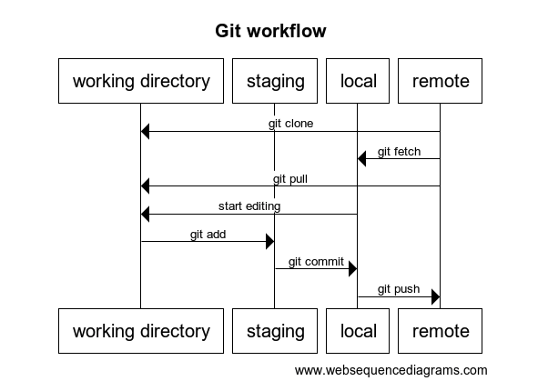

# Working with git

This document explains the basic git workflow

## Installing git

This depends on your operating system, but there are versions of git available for Windows, Linux and Mac

## Using git

Git can be used from the command line or with tools and IDEs that offer a GUI. For this document, we will be using the command line.

## Basic workflow (when working with a remote repository)

First you will need to _clone_ the repository:

```bash
git clone https://github.com/ianrobrien/dnb-summer-mentorship-2020.git
```

This will create a copy of the repository at the directory in which the command was executed. This gives you a _local_ copy of the repository.

## Editing files

Once you edit a file it is tracked in git as a change. You can view these changes at any time by typing:

```bash
git diff
```

This will run the diff tool in the command line. There are ways to customize which diff tool is used but for this document we will focus only on the built-in diff tool.

## Adding new files

New files can be added by simply creating the file and then adding them in the `git add` stage. New files will not show up in the diff because there is not a change from a previous file. However, new files can be seen by running `git status`

## Getting the status of the local repository

If you want to see the status of the repo, that is files which have been added, removed or modified, you can run

```bash
git status
```

## Committing your changes

Committing your change is a two-step process. First, you must stage the files with `git add`, and then you need to commit the files with `git commit`

### Adding changes to staging

Staging is an area where your modified files sit and wait to be committed. In order to commit a file, you first add it to staging by running

```bash
# Specify which file you would like to add, or use the period (.) to add all files in the current directory and sub directory
git add
```

Now your files are in staging. Notice that if you run `git diff` the differences do not show up. That is because `git diff` shows _unstaged_ diffs. Run `git status` to see which files are staged and unstaged.

If you want to see the diff of your staged files, then you can run `git diff --staged`

### Commiting changes to staging

When you are satisfied with what is in staging, you can commit these changes _to your local repository_ by typing `git commit`. A window will open where you can type a commit message. When this is done, the changes will be committed to your local repository.

Note: `git add` will stage the changes as they are at the moment you run the command. If you stage a file, and then edit it again, the new changes will not be in staging until you run `git add` again.

## Pushing to remote repo

Once you have committed changes locally, you can push them to the remote repo. Run `git status` to see how your repo is different than the remote repo. When you are ready to push your changes to the remote repo, you can run

```bash
git push
```

After a push, these changes are available to everyone else who has the repo, and they will pick up your changes when the run `git pull`

## Getting changes from the remote repo

You can get changes from the remote repo by running `git pull`. This will update files in your working directory, so if you have any conflicting changes you will get an error and the command will abort.

## Git workflow diagram



## Commands learned

```bash
git clone
git pull
git add
git diff
git diff --staged
git commit
git push
```
